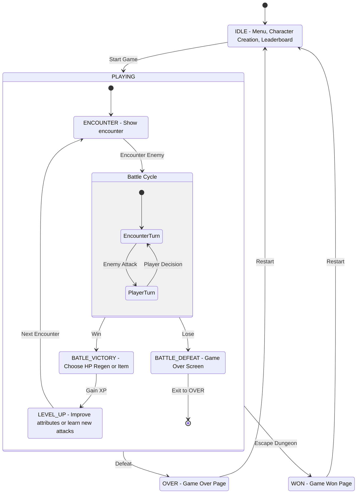

```mermaid
stateDiagram-v2
    [*] --> Idle
    Idle --> PLAYING: Start Game
    PLAYING --> Over: Defeat
    PLAYING --> Won: Escape Dungeon
    Over --> Idle: Restart
    Won --> Idle: Restart
    
    state PLAYING {
        [*] --> Encounter
        Encounter --> Battle: Encounter Enemy
        Battle --> BattleVictory: Win
        Battle --> BattleDefeat: Lose
        BattleVictory --> LevelUp: Gain XP
        LevelUp --> Encounter: Next Encounter
        BattleDefeat --> [*]: Exit to OVER
        Battle: Battle Cycle
        
        state Battle {
            [*] --> EncounterTurn
            EncounterTurn --> PlayerTurn: Enemy Attack
            PlayerTurn --> EncounterTurn: Player Decision
        }
    }
    
    Idle: IDLE - Menu, Character Creation, Leaderboard
    Over: OVER - Game Over Page
    Won: WON - Game Won Page
    Encounter: ENCOUNTER - Show encounter
    BattleVictory: BATLE_VICTORY - Choose HP Regen or Item
    BattleDefeat: BATTLE_DEFEAT - Game Over Screen
    LevelUp: LEVEL_UP - Improve attributes or learn new attacks

```