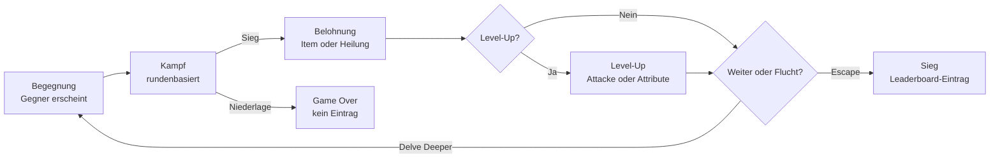
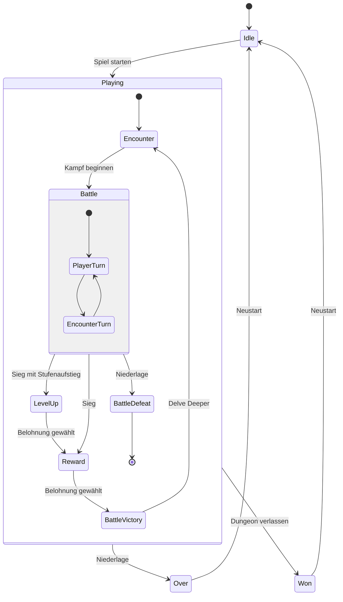
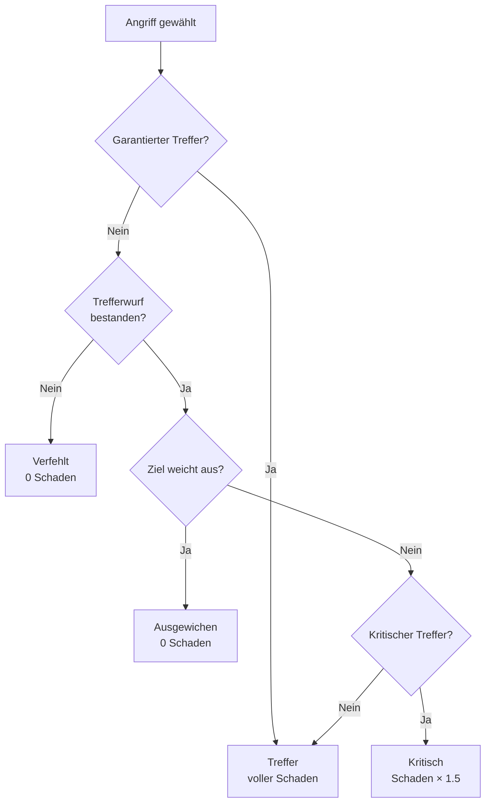

# Eternal Depths – Spielkonzept

> Diese Dokumentation beschreibt ausschliesslich das Spielkonzept und die Spielmechanik von
> *Eternal Depths*. Technische Umsetzung, Architektur und Technologien sind bewusst nicht
> Bestandteil dieses Dokuments.

---

## Inhaltsverzeichnis

1. [Spielidee](#1-spielidee)
2. [Kernschleife](#2-kernschleife)
3. [Spielzustände und Spielzyklus](#3-spielzustände-und-spielzyklus)
4. [Charakter](#4-charakter)
5. [Attribute und abgeleitete Werte](#5-attribute-und-abgeleitete-werte)
6. [Dungeon, Stages und Gegner](#6-dungeon-stages-und-gegner)
7. [Kampfsystem](#7-kampfsystem)
8. [Attacken](#8-attacken)
9. [Ausrüstung und Items](#9-ausrüstung-und-items)
10. [Belohnungen nach dem Kampf](#10-belohnungen-nach-dem-kampf)
11. [Fortschritt und Level-Up](#11-fortschritt-und-level-up)
12. [Spielende: Flucht oder Tod](#12-spielende-flucht-oder-tod)
13. [Leaderboard](#13-leaderboard)
14. [Spielregeln in Kurzform](#14-spielregeln-in-kurzform)
15. [Balancing-Referenz](#15-balancing-referenz)
16. [Abgrenzung](#16-abgrenzung)
17. [Konzeptionelle Offene Punkte und Ausblick](#17-konzeptionelle-offene-punkte-und-ausblick)

---

## 1. Spielidee

*Eternal Depths* ist ein rundenbasiertes Single-Player-RPG mit Roguelike-Charakter. Der Spieler
erstellt einen Helden und steigt in einen zufällig generierten, endlosen Dungeon hinab. Jede
Stage besteht aus genau einer Begegnung mit einem Gegner. Nach jedem gewonnenen Kampf steht die
zentrale Entscheidung an: **tiefer hinabsteigen** – für mehr Ruhm, aber gegen stärkere Gegner –
oder **den Dungeon verlassen** und den erreichten Fortschritt dauerhaft im Leaderboard sichern.

Der Reiz des Spiels entsteht aus dieser Risiko-Abwägung:

- Der Dungeon ist **unendlich tief** – es gibt kein Ende, das man „durchspielen" kann.
- Der Fortschritt zählt **nur**, wenn der Spieler den Dungeon lebend verlässt.
- Ein Tod im Dungeon löscht den gesamten Durchgang: kein Leaderboard-Eintrag, kein Fortschritt.
- Jeder Durchgang ist einzigartig, da Gegner, Gegenstände und erlernbare Attacken zufällig
  generiert werden.

Es gibt keine Speicherstände und keine Persistenz zwischen Durchgängen. Jeder neue Held beginnt
bei null; der einzige bleibende Wert ist der Eintrag im Leaderboard.

---

## 2. Kernschleife



Eine vollständige Iteration der Kernschleife dauert wenige Minuten und besteht aus:

1. **Begegnung** – der Gegner der aktuellen Stage wird gezeigt, der Spieler startet den Kampf.
2. **Kampf** – rundenbasierter Schlagabtausch bis eine Seite auf 0 HP fällt.
3. **Belohnung** – Wahl zwischen einem zufälligen Ausrüstungsgegenstand und Lebenspunkten.
4. **Level-Up** (bedingt) – bei Erreichen der XP-Schwelle: neue Attacke oder Attributspunkte.
5. **Entscheidung** – nächste Stage betreten oder den Dungeon verlassen.

---

## 3. Spielzustände und Spielzyklus

Das Spiel kennt vier übergeordnete Zustände. Innerhalb des Zustands *Playing* läuft der
eigentliche Spielzyklus mit seinen Phasen, und innerhalb der Kampfphase wiederum ein eigener
Kampfzyklus.

| Zustand     | Bedeutung                                                              |
| ----------- | ---------------------------------------------------------------------- |
| **Idle**    | Hauptmenü, Charaktererstellung, Leaderboard – kein aktiver Durchgang    |
| **Playing** | Der Held befindet sich im Dungeon, der Spielzyklus läuft                |
| **Won**     | Der Dungeon wurde erfolgreich verlassen – Eintragung ins Leaderboard    |
| **Over**    | Der Held ist gefallen – Durchgang verloren                             |



**Phasen des Spielzyklus**

| Phase              | Beschreibung                                                                     |
| ------------------ | -------------------------------------------------------------------------------- |
| **Encounter**      | Der Gegner der Stage wird präsentiert; der Kampf wird bewusst vom Spieler gestartet |
| **Battle**         | Rundenbasierter Kampf (eigener Kampfzyklus)                                      |
| **Level-Up**       | Nur bei erreichter XP-Schwelle: neue Attacke oder Attributspunkte                |
| **Reward**         | Wahl der Kampfbelohnung: Gegenstand oder Lebenspunkte                            |
| **Battle Victory** | Entscheidung: nächste Stage oder Flucht aus dem Dungeon                          |
| **Battle Defeat**  | Niederlage – der Durchgang endet endgültig                                       |

> **Reihenfolge:** Wird durch den Sieg die XP-Schwelle überschritten, erscheint zuerst die
> Level-Up-Maske und danach die Belohnungsauswahl. Ohne Stufenaufstieg folgt die
> Belohnungsauswahl unmittelbar auf den Sieg.

---

## 4. Charakter

### 4.1 Charaktererstellung

Vor dem ersten Abstieg erstellt der Spieler seinen Helden:

1. **Aussehen** – Auswahl aus sechs vorgegebenen Erscheinungsbildern (rein kosmetisch, ohne
   Einfluss auf die Werte; wird im Leaderboard mit angezeigt).
2. **Name** – frei wählbar, ein Name ist zwingend erforderlich.
3. **Attributsverteilung** – zwei zusätzliche Attributspunkte werden auf die vier Attribute
   verteilt. Beide Punkte müssen vergeben werden, bevor der Dungeon betreten werden kann.

### 4.2 Startausstattung

| Element        | Startwert                                                    |
| -------------- | ------------------------------------------------------------ |
| Attribute      | Leben 1, Stärke 1, Schnelligkeit 1, Präzision 1              |
| Freie Punkte   | 2 (bei Erstellung zu verteilen)                              |
| Stufe          | 1 (0 XP)                                                     |
| Waffe          | *Rusty Sword* – 3 bis 9 Waffenschaden                        |
| Rüstung        | Keine (alle Rüstungsslots leer)                              |
| Attacken       | *Base Attack* – Standardangriff ohne Abklingzeit             |

Es existiert kein Inventar. Alles, was der Held besitzt, ist unmittelbar angelegt.

---

## 5. Attribute und abgeleitete Werte

Vier Attribute bestimmen die gesamte Kampfleistung. Jedes Attribut hat eine klar spürbare,
eigenständige Wirkung – es gibt keine „toten" Attribute.

| Attribut          | Wirkung                                                                   |
| ----------------- | ------------------------------------------------------------------------- |
| **Leben**         | Erhöht die maximalen Lebenspunkte                                          |
| **Stärke**        | Erhöht den verursachten Schaden                                            |
| **Schnelligkeit** | Bestimmt die Zugreihenfolge/-häufigkeit und die Ausweichchance             |
| **Präzision**     | Erhöht die Trefferchance und die Chance auf kritische Treffer              |

### 5.1 Abgeleitete Werte

| Wert                 | Berechnung                                                   | Grenzen              |
| -------------------- | ------------------------------------------------------------ | -------------------- |
| Maximale HP          | `90 + Leben × 10`                                            | –                    |
| Schadensmodifikator  | `abrunden(Stärke × 0.7)`                                     | mindestens 1         |
| Ausweichchance       | `Schnelligkeit × 2 %`                                        | maximal 60 %         |
| Kritische Trefferchance | `Präzision × 2 %`                                         | maximal 60 %         |
| Trefferchance        | `60 % + (Präzision − Schnelligkeit des Ziels) × 5 %`         | 40 % bis 90 %        |

Beispiel: Ein Held mit Leben 3 besitzt 120 maximale Lebenspunkte; mit Stärke 5 addiert er 3
Schadenspunkte auf jeden Waffenschlag.

### 5.2 Zusammensetzung der effektiven Werte

Die im Kampf wirksamen Werte setzen sich zusammen aus:

```
Effektiver Wert = Basisattribut + Summe der Ausrüstungsboni + aktive Buffs
```

Der Waffenschaden (min/max) stammt ausschliesslich aus der ausgerüsteten Waffe und wird nicht
durch Attribute verändert – die Stärke wirkt als separater Zuschlag auf den Wurf.

---

## 6. Dungeon, Stages und Gegner

### 6.1 Aufbau des Dungeons

Der Dungeon ist in **Stages** unterteilt. Jede Stage enthält genau eine Begegnung. Der Spieler
beginnt auf Stage 1; der Dungeon hat keine Obergrenze.

- Der Schauplatz (Höhle oder Dungeonraum) wird pro Stage zufällig aus den zum Gegner passenden
  Umgebungen gewählt.
- Der Gegnertyp wird pro Stage zufällig gezogen.
- **Alle fünf Stages** (Stage 5, 10, 15, …) erscheint ein **Boss** aus einem eigenen, deutlich
  stärkeren Gegnerpool.

### 6.2 Gegnerlevel und Skalierung

Das Gegnerlevel steigt alle fünf Stages um eins:

```
Gegnerlevel = abrunden((Stage − 1) / 5) + 1
```

| Stages | Gegnerlevel |
| ------ | ----------- |
| 1–5    | 1           |
| 6–10   | 2           |
| 11–15  | 3           |
| 16–20  | 4           |
| …      | …           |

Die Werte eines Gegners werden bei jeder Begegnung neu generiert:

1. Der Gegnertyp bringt seine **Basiswerte** mit (siehe Gegnerkatalog).
2. Auf **jedes** Attribut wird `Gegnerlevel − 1` addiert.
3. Zusätzlich werden `Gegnerlevel × 2` Punkte **zufällig** auf die vier Attribute verteilt.

Dadurch ist selbst derselbe Gegnertyp auf derselben Stage nie exakt gleich stark – ein Goblin
kann als flinker Ausweicher oder als robuster Schläger auftreten.

### 6.3 Gegnerwerte im Kampf

Gegner verwenden dieselben Formeln wie der Held, jedoch mit einem **Gegner-Modifikator von 30 %**
auf Lebenspunkte und Schadensmodifikator. Ohne diese Abschwächung wären die durch Level-Skalierung
stark anwachsenden Gegnerwerte nicht spielbar.

| Wert                    | Berechnung                                                        |
| ----------------------- | ----------------------------------------------------------------- |
| Maximale HP             | `(90 + Leben × 10) × 0.3`                                         |
| Schadensmodifikator     | `abrunden(Stärke × 0.7 × 0.3)`, mindestens 1                      |
| Schadensbereich         | Untergrenze = Schadensmodifikator, Obergrenze = doppelter Modifikator |
| Ausweichen / Kritisch / Treffen | identische Formeln wie beim Helden                        |

Gegner besitzen **keine** Spezialattacken – sie führen ausschliesslich Standardangriffe aus.
Ihre Bedrohlichkeit ergibt sich aus Werteverteilung, Zugfrequenz und Boss-Status.

### 6.4 Gegnerkatalog

**Normale Gegner** (Basiswerte vor Levelskalierung)

| Gegner      | Leben | Stärke | Schnelligkeit | Präzision | Charakteristik                    |
| ----------- | :---: | :----: | :-----------: | :-------: | --------------------------------- |
| Barbar      |   2   |   2    |       1       |     1     | Ausgewogener Schläger             |
| Riesenfledermaus | 1 |   1    |       3       |     1     | Extrem flink, weicht oft aus      |
| Goblin      |   1   |   2    |       2       |     1     | Schnell und aggressiv             |
| Ork         |   3   |   2    |       0       |     0     | Zäh, aber langsam und ungenau     |
| Halunke     |   1   |   1    |       1       |     1     | Völlig ausgeglichen                |
| Skelett     |   2   |   1    |       1       |     0     | Robust, wenig gefährlich          |
| Schlange    |   1   |   1    |       2       |     2     | Trifft zuverlässig und kritisch   |
| Spinne      |   1   |   1    |       2       |     1     | Flink                             |
| Dieb        |   1   |   0    |       2       |     3     | Sehr präzise, kaum Schaden        |
| Wolf        |   2   |   2    |       1       |     0     | Solider Nahkämpfer                |

**Bosse** (jede fünfte Stage)

| Boss           | Leben | Stärke | Schnelligkeit | Präzision | Charakteristik                  |
| -------------- | :---: | :----: | :-----------: | :-------: | ------------------------------- |
| Feuerdrache    |   3   |   3    |       2       |     2     | Rundum stark                    |
| Lich           |   2   |   2    |       3       |     3     | Schnell und treffsicher         |
| Verrückter Magier |  2  |   3    |       2       |     3     | Hoher Schaden, hohe Präzision   |
| Schattendrache |   2   |   4    |       2       |     2     | Höchster Schadensoutput         |
| Vampirlord     |   3   |   2    |       3       |     3     | Zäh, schnell und präzise        |

---

## 7. Kampfsystem

Der Kampf ist rundenbasiert. Der Spieler wählt pro Zug genau eine Attacke; der Gegner greift
automatisch an. Der Kampf endet, sobald eine Seite auf 0 Lebenspunkte fällt.

### 7.1 Initiative und Zugreihenfolge

Die Zugreihenfolge wird nicht als starres „einer nach dem anderen" abgebildet, sondern über einen
Initiativezähler – dadurch können schnelle Kämpfer **mehrfach hintereinander** handeln.

1. Zu Kampfbeginn erhalten beide Seiten einen Initiativewert in Höhe ihrer **Schnelligkeit**.
2. Wer den höheren Wert hat, beginnt. **Bei Gleichstand beginnt der Spieler.**
3. Jede ausgeführte Aktion kostet der handelnden Seite **5 Initiativepunkte**.
4. Fällt die Initiative auf 0 oder darunter, wird die **Schnelligkeit** wieder aufaddiert und der
   Zug wechselt zur Gegenseite.

Praktische Konsequenz: Wer deutlich mehr Schnelligkeit besitzt, erhält zusätzliche Aktionen,
bevor der Zug wechselt. Schnelligkeit ist damit gleichzeitig offensiv (mehr Aktionen) und
defensiv (Ausweichen) wertvoll.

### 7.2 Ablauf eines Angriffs



Die Prüfungen erfolgen in genau dieser Reihenfolge. Attacken mit der Eigenschaft
*garantierter Treffer* (`safeHit`) überspringen Treffer-, Ausweich- und Kritischprüfung
vollständig – sie treffen immer, können aber auch nie kritisch treffen.

### 7.3 Schadensberechnung

```
1. Zufallswurf zwischen (Waffen-Minimalschaden + Schadensmodifikator)
   und (Waffen-Maximalschaden + Schadensmodifikator)
2. + Attackenbonus (kann negativ sein, z. B. bei Mehrfachschlägen)
3. Ergebnis wird auf mindestens 1 Schadenspunkt angehoben
4. Bei kritischem Treffer: Ergebnis × 1.5 (abgerundet)
```

Der **Schadensmodifikator** ist der aus der Stärke abgeleitete Wert (siehe Abschnitt 5.1).
Bei Attacken mit mehreren Treffern wird für **jeden einzelnen Treffer** ein vollständig
eigener Wurf inklusive Treffer-, Ausweich- und Kritischprüfung durchgeführt.

### 7.4 Verteidigungsmechaniken

Es gibt keinen Rüstungswert, der Schaden reduziert. Die Verteidigung funktioniert
ausschliesslich über **Vermeidung**:

- **Verfehlen** – abhängig von der Präzision des Angreifers gegen die Schnelligkeit des Ziels.
- **Ausweichen** – abhängig ausschliesslich von der Schnelligkeit des Ziels.

Zusätzlich erhöhen Rüstungsteile die maximalen Lebenspunkte und die Attribute – Überleben wird
also über mehr HP und höhere Ausweichwerte erreicht, nicht über Schadensreduktion.

### 7.5 Kampfende

| Ereignis                | Folge                                                            |
| ----------------------- | ---------------------------------------------------------------- |
| Gegner-HP ≤ 0           | Sieg – XP werden gutgeschrieben, danach Level-Up und/oder Belohnung |
| Helden-HP ≤ 0           | Niederlage – Game Over, der gesamte Durchgang ist verloren        |

Die Prüfung erfolgt nach jeder Aktion. Selbstschaden durch eigene Attacken kann den Helden
ebenfalls töten.

---

## 8. Attacken

### 8.1 Grundprinzip

- Der Held kann **maximal drei Attacken** gleichzeitig ausgerüstet haben.
- Zum Start besitzt er die *Base Attack* – einen Standardschlag ohne Abklingzeit, der immer
  verfügbar ist.
- Neue Attacken werden **ausschliesslich beim Level-Up** erlernt und zufällig angeboten.
- Sind bereits drei Attacken ausgerüstet, muss eine bestehende ersetzt werden – auch die
  *Base Attack* kann ersetzt werden.

### 8.2 Abklingzeiten (Cooldown)

- Nach dem Einsatz wird eine Attacke für die Dauer ihrer Abklingzeit gesperrt.
- Die Abklingzeiten **aller** Attacken reduzieren sich um 1, sobald der Held handelt.
- Eine **neu erlernte Attacke startet auf voller Abklingzeit** – sie kann also nicht sofort
  eingesetzt werden.
- Stehen keine Attacken zur Verfügung, ist die Gegenseite wieder am Zug.

### 8.3 Attackeneigenschaften

Attacken können folgende Eigenschaften kombinieren:

| Eigenschaft            | Wirkung                                                              |
| ---------------------- | -------------------------------------------------------------------- |
| Trefferanzahl          | Anzahl separater Angriffswürfe pro Einsatz                           |
| Zusatzschaden          | Auf- oder Abschlag auf den Schadenswurf (kann negativ sein)          |
| Garantierter Treffer   | Überspringt Treffer-, Ausweich- und Kritischprüfung                  |
| Selbstheilung          | Fester Wert oder „automatisch" (= gesamter verursachter Schaden)     |
| Selbstschaden          | Der Held erleidet den Wert beim Einsatz selbst                       |
| Buffs                  | Temporäre Attributserhöhungen mit fester Dauer                       |
| Abklingzeit            | Züge, bis die Attacke erneut einsetzbar ist                          |

### 8.4 Attackenkatalog

| Attacke              | CD | Wirkung                                                                                            |
| -------------------- | :-: | -------------------------------------------------------------------------------------------------- |
| **Base Attack**      | 0  | Standardangriff, jederzeit verfügbar                                                                |
| **Drain**            | 2  | Ein Treffer; der Held heilt sich um den vollen verursachten Schaden                                 |
| **Double Strike**    | 1  | Zwei Treffer mit je 3 Schaden Abzug                                                                 |
| **Dance of the Dead**| 2  | Drei Treffer mit je 4 Schaden Abzug; +5 Schnelligkeit für 1 Zug                                     |
| **Bloodlust**        | 2  | Ein Treffer; +5 Stärke und +5 Präzision für 1 Zug                                                   |
| **Berserk Strike**   | 4  | Garantierter Treffer mit +20 Schaden; 6 Selbstschaden; +7 Stärke für 2 Züge                         |
| **Death Blow**       | 10 | Garantierter Treffer mit +100 Schaden – die stärkste Attacke des Spiels bei sehr langer Abklingzeit |

### 8.5 Buff-Mechanik

- Buffs erhöhen ein Attribut temporär und wirken sich sofort auf alle abgeleiteten Werte aus
  (z. B. erhöht ein Schnelligkeits-Buff Ausweichchance **und** Initiativegewinn).
- Die Dauer wird nach jeder Aktion des Helden um 1 reduziert; abgelaufene Buffs verfallen.
- Ein Buff aus der aktuellen Aktion wirkt ab dem folgenden Zug.
- Buffs gelten nur innerhalb des laufenden Kampfes.

---

## 9. Ausrüstung und Items

### 9.1 Ausrüstungsslots

Es gibt **kein Inventar**. Jeder Gegenstand wird sofort angelegt oder verworfen; ein besetzter
Slot kann nur durch direkten Austausch neu belegt werden.

| Slot          | Attribute, die der Gegenstand verbessern kann |
| ------------- | ---------------------------------------------- |
| Kopf (Helm)   | Leben, Präzision                               |
| Körper (Rüstung) | Leben, Stärke, Schnelligkeit                |
| Hände (Handschuhe) | Stärke, Schnelligkeit, Präzision          |
| Füsse (Beinschienen) | Schnelligkeit, Präzision                |
| Schild        | Leben                                          |
| Waffe (Schwert) | Minimal- und Maximalschaden                  |

### 9.2 Seltenheitsstufen

Jeder gefundene Gegenstand erhält eine zufällige Seltenheit, die bestimmt, wie viele
Werte-Punkte er mitbringt:

| Seltenheit    | Fundchance | Basis-Wertepunkte |
| ------------- | :--------: | :---------------: |
| **Common**    |   65 %     |         1         |
| **Rare**      |   20 %     |         3         |
| **Epic**      |   10 %     |         5         |
| **Legendary** |    5 %     |         8         |

### 9.3 Gegenstandsgenerierung

Gegenstände skalieren mit der **Stufe des Helden**, nicht mit der Stage:

```
Wertepunkte = Basis-Wertepunkte der Seltenheit + (Heldenstufe − 1)
```

- **Rüstungsteile und Schilde:** Die Wertepunkte werden zufällig auf die für den Slot
  zulässigen Attribute verteilt. Ein *Legendary*-Helm auf Stufe 4 verteilt also 11 Punkte
  zufällig auf Leben und Präzision.
- **Waffen:** Die Wertepunkte werden verdoppelt und um 12 erhöht, anschliessend zufällig in
  Minimal- und Maximalschaden aufgeteilt. Dadurch entstehen sowohl verlässliche Waffen mit
  engem Schadensfenster als auch Glücksspiel-Waffen mit grosser Spannweite.

Jeder Gegenstand ist damit ein Unikat: Zwei *Rare*-Rüstungen derselben Stufe können völlig
unterschiedliche Werteprofile besitzen.

### 9.4 Austausch von Gegenständen

Ist der passende Slot bereits belegt, werden alter und neuer Gegenstand direkt gegenübergestellt
(Name, Seltenheit, Werte). Der Spieler entscheidet, ob er ersetzt. Der ersetzte Gegenstand geht
verloren – es gibt keine Möglichkeit, ihn aufzubewahren.

---

## 10. Belohnungen nach dem Kampf

Nach **jedem** gewonnenen Kampf wählt der Spieler genau eine von zwei Belohnungen:

| Option                     | Wirkung                                                            |
| -------------------------- | ------------------------------------------------------------------ |
| **Zufälliger Gegenstand**  | Ein neu generierter Ausrüstungsgegenstand (Seltenheit und Werte zufällig, skaliert mit der Heldenstufe) |
| **Nahrung (HP-Regeneration)** | Sofortige Heilung um einen stagenabhängigen Betrag             |

Der Heilbetrag wächst mit der Dungeontiefe und ist gedeckelt:

```
Heilung = min( abrunden(Stage / 5) × 10 + 5 , 50 )
```

| Stage   | Heilung |
| ------- | :-----: |
| 1–4     |    5    |
| 5–9     |   15    |
| 10–14   |   25    |
| 15–19   |   35    |
| 20–24   |   45    |
| ab 25   |   50    |

Diese Wahl ist die zweite zentrale Risiko-Entscheidung des Spiels: Ausrüstung macht dauerhaft
stärker, Heilung verlängert den aktuellen Durchgang. Da Lebenspunkte zwischen den Kämpfen nur
sehr begrenzt zurückkehren, wird Heilung mit zunehmender Tiefe immer wertvoller.

**Zusätzliche Regeneration:** Beim Betreten der nächsten Stage erhält der Held automatisch
**15 Lebenspunkte** zurück. Ein Level-Up stellt die Lebenspunkte **vollständig** wieder her.

---

## 11. Fortschritt und Level-Up

### 11.1 Erfahrungspunkte

Erfahrungspunkte gibt es ausschliesslich für besiegte Gegner. Die Menge hängt vom **Gegnerlevel**
ab (nicht von der Stage) und ist gedeckelt:

```
XP = min( runden(Gegnerlevel × 5 / 2) , 30 )
```

Das bedeutet konkret: In den Stages 1–5 (Gegnerlevel 1) bringt jeder Sieg 3 XP, in den Stages
6–10 (Gegnerlevel 2) 5 XP, und ab Gegnerlevel 12 ist der Höchstwert von 30 XP pro Sieg erreicht.

### 11.2 Stufenschwelle

```
Benötigte XP für die nächste Stufe = Stufe² × 10
```

| Stufe | Benötigte XP | Kumuliert |
| :---: | :----------: | :-------: |
| 1 → 2 |      10      |    10     |
| 2 → 3 |      40      |    50     |
| 3 → 4 |      90      |   140     |
| 4 → 5 |     160      |   300     |
| 5 → 6 |     250      |   550     |

Überschüssige XP werden beim Stufenaufstieg auf die nächste Stufe übertragen. Die quadratisch
wachsende Schwelle sorgt dafür, dass Stufenaufstiege in der Tiefe immer seltener und dadurch
bedeutsamer werden – der Charakter wächst zunehmend über Ausrüstung statt über Stufen.

### 11.3 Belohnung beim Level-Up

Bei einem Stufenaufstieg wählt der Spieler zwischen:

| Option              | Wirkung                                                                     |
| ------------------- | --------------------------------------------------------------------------- |
| **Neue Attacke**    | Eine zufällig gezogene Spezialattacke wird erlernt (ggf. Ersatz einer bestehenden) |
| **Attribute**       | Zwei frei verteilbare Attributspunkte                                        |

Unabhängig von der Wahl werden die **Lebenspunkte vollständig regeneriert**. Beide Punkte müssen
vollständig verteilt werden, bevor es weitergeht.

Die Entscheidung ist bewusst nicht trivial: Attributspunkte wirken dauerhaft und auf alle Kämpfe,
eine neue Attacke kann einen Kampf dagegen situativ komplett drehen – belegt aber einen der nur
drei Attackenslots.

---

## 12. Spielende: Flucht oder Tod

Nach jedem gewonnenen Kampf (und **nur** dort) stehen zwei Optionen zur Wahl:

| Aktion           | Folge                                                                          |
| ---------------- | ------------------------------------------------------------------------------ |
| **Delve Deeper** | Nächste Stage; +15 HP; ein neuer, stärkerer Gegner wird generiert              |
| **Escape**       | Der Dungeon wird verlassen – der Durchgang gilt als **gewonnen**               |

**Flucht ist nur zwischen zwei Kämpfen möglich.** Ein laufender Kampf kann nicht abgebrochen
werden – wer einen Kampf beginnt, muss ihn zu Ende führen.

**Niederlage:** Fallen die Lebenspunkte des Helden auf 0, endet der Durchgang sofort. Es gibt
keine Wiederbelebung, keinen Fortschritt und **keinen Leaderboard-Eintrag**. Die erreichte
Stage wird zwar angezeigt, aber nicht gewertet.

Damit trägt jede Entscheidung „noch eine Stage" ein echtes Risiko: Der gesamte angesammelte
Fortschritt eines Durchgangs steht bei jedem weiteren Kampf auf dem Spiel.

---

## 13. Leaderboard

Das Leaderboard ist das einzige dauerhafte Element des Spiels und der zentrale Langzeitanreiz.

- Ein Eintrag entsteht **ausschliesslich** durch erfolgreiche Flucht aus dem Dungeon.
- Der Spieler gibt beim Verlassen einen Spielernamen an; der Eintrag speichert zusätzlich den
  Charakternamen, das Aussehen des Helden und die erreichte Stage.
- Die Rangliste ist **nach erreichter Stage absteigend** sortiert.
- Der Spieler kann auf den Eintrag verzichten und den Durchgang ohne Wertung beenden.
- Das Leaderboard ist aus dem Hauptmenü jederzeit einsehbar.

Bewertet wird also nicht die Charakterstärke, sondern **wie tief der Spieler gekommen ist, ohne
zu sterben** – genau die Abwägung, um die sich die gesamte Kernschleife dreht.

---

## 14. Spielregeln in Kurzform

1. Kämpfe sind rundenbasiert; die Zugreihenfolge richtet sich nach der Schnelligkeit.
2. Gegner und Schauplätze werden zufällig generiert; Gegnerwerte skalieren mit dem Fortschritt.
3. Alle fünf Stages erscheint ein stärkerer Boss.
4. Nach jedem Kampf wird zwischen HP-Regeneration und einem Gegenstand gewählt.
5. Maximal drei Attacken können gleichzeitig ausgerüstet sein.
6. Ein Level-Up erlaubt entweder das Erhöhen von Attributen oder das Erlernen einer Attacke und
   heilt den Helden vollständig.
7. Ausrüstung wird ohne Inventar direkt getragen und bei Neufunden direkt ersetzt.
8. Der Dungeon kann nur nach einem gewonnenen Kampf verlassen werden.
9. Nur ein erfolgreich verlassener Dungeon führt zu einem Leaderboard-Eintrag.
10. Der Tod beendet den Durchgang endgültig und ohne Wertung.

---

## 15. Balancing-Referenz

Sämtliche Stellschrauben des Spielgefühls auf einen Blick.

### Charakter

| Grösse                        | Wert   |
| ----------------------------- | :----: |
| Basis-Lebenspunkte            |   90   |
| HP pro Lebenspunkt            |   10   |
| Schadensmodifikator pro Stärkepunkt | 0.7 |
| Ausweichchance pro Schnelligkeitspunkt | 2 % |
| Kritische Chance pro Präzisionspunkt | 2 % |
| Trefferchance pro Präzisionspunkt (relativ zur Schnelligkeit des Ziels) | 5 % |
| Basis-Trefferchance           |  60 %  |
| Trefferchance (min / max)     | 40 % / 90 % |
| Ausweichchance (max)          |  60 %  |
| Kritische Chance (max)        |  60 %  |
| Kritischer Schadensmultiplikator | ×1.5 |
| Attributspunkte bei Erstellung |   2   |
| Attributspunkte pro Level-Up  |   2    |
| Maximale Attackenslots        |   3    |
| Startwaffe                    | 3–9 Schaden |

### Gegner

| Grösse                         | Wert           |
| ------------------------------ | :------------: |
| Gegner-Wertemodifikator (HP und Schaden) | 30 %  |
| Levelaufstieg                  | alle 5 Stages  |
| Boss-Intervall                 | jede 5. Stage  |
| Attributspunkte pro Gegnerlevel | Level × 2 zufällig + 1 pro Attribut |

### Fortschritt und Belohnung

| Grösse                     | Wert                              |
| -------------------------- | --------------------------------- |
| XP pro Sieg                | `min(runden(Gegnerlevel × 5 / 2), 30)` |
| XP-Schwelle                | `Stufe² × 10`                     |
| Heilung „Nahrung"          | `min(abrunden(Stage / 5) × 10 + 5, 50)` |
| Heilung beim Stagewechsel  | 15 HP                             |
| Heilung beim Level-Up      | vollständig                       |
| Item-Wertepunkte           | Seltenheitsbasis + (Heldenstufe − 1) |
| Waffen-Wertepunkte         | (Wertepunkte × 2) + 12            |

---

## 16. Abgrenzung

Bewusste konzeptionelle Einschränkungen des Spiels:

- **Keine Story** – es gibt keine erzählte Handlung, nur Rahmentexte bei Sieg und Niederlage.
- **Kein Multiplayer** – reines Single-Player-Erlebnis; der einzige Wettbewerb läuft indirekt
  über das Leaderboard.
- **Keine Speicherstände** – ein Durchgang wird in einer Sitzung gespielt und endet mit Flucht
  oder Tod.
- **Kein Inventar, keine Währung, kein Handel** – Gegenstände werden gefunden und sofort
  getragen oder verworfen.
- **Keine Elementtypen oder Resistenzen** – der Schaden ist einheitlich und kennt keine
  Stärken/Schwächen-Matrix.
- **Keine Gegner-Spezialattacken** – Gegner greifen ausschliesslich mit Standardangriffen an.
- **Einsprachig** – das Spiel ist ausschliesslich auf Englisch verfügbar.

---

## 17. Konzeptionelle Offene Punkte und Ausblick

### Bekannte konzeptionelle Lücken

- **Handschuhe ohne Wirkung:** Handschuhe sind als Slot vorgesehen und können gefunden werden,
  fliessen aktuell aber nicht in die effektiven Charakterwerte ein. Entweder muss der Slot
  vollwertig integriert oder aus dem Belohnungspool entfernt werden.
- **Attacken-Ersatz kann den Standardangriff verdrängen:** Da auch die *Base Attack* ersetzbar
  ist, kann sich der Held in eine Situation manövrieren, in der alle Attacken gleichzeitig auf
  Abklingzeit stehen und Züge ungenutzt verstreichen.
- **Balancing in der Tiefe:** Die Gegnerskalierung ist linear, die XP-Schwelle wächst dagegen
  quadratisch. Ab grosser Tiefe verschiebt sich das Kräfteverhältnis zunehmend zugunsten der
  Gegner – das ist als Endlichkeitsmechanik gewollt, die genaue Schwelle ist jedoch nicht
  feinjustiert.

### Ideen für die Weiterentwicklung

- Verbrauchsgegenstände (Tränke, Bomben) als dritte Belohnungsoption
- Gold als Belohnung sowie ein Händler zwischen den Stages
- Spezialattacken auch für Gegner, insbesondere für Bosse
- Elementtypen für Waffen und Rüstungen inklusive Stärken/Schwächen
- Einmalige Wiederbelebung als optionale Zweitchance
- Ausführliche Spielanleitung im Hauptmenü
- Detailansicht des Charakters mit allen Attributen, Ausrüstungsteilen und Attacken
